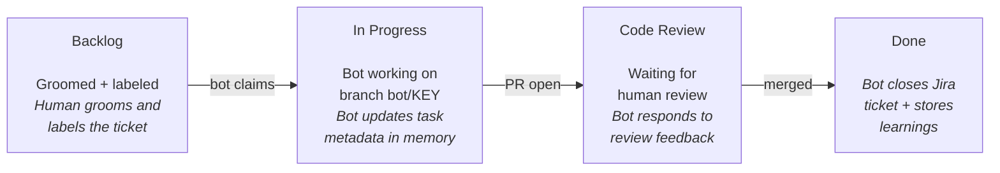

# Operations Guide

How to manage and monitor the bot in day-to-day use.

## Monitoring

### Jira Filter

All bot-eligible tickets across teams are tracked via a shared Jira filter:

**Filter ID**: [107017](https://redhat.atlassian.net/issues/?filter=107017)

**JQL**: `project = RHCLOUD AND labels in (hcc-ai-framework, hcc-ai-platform-accessmanagement, hcc-ai-ui, hcc-ai-integrations)`

This shows all tickets tagged for the bot, regardless of status. Use it to see what the bot is working on, what's queued, and what's done.

To add a new team's tickets, add their label to the filter (e.g. `hcc-ai-<team-name>`).

### Dashboard

The memory server dashboard at `http://localhost:8080` shows:
- **Active tasks** — what the bot is currently working on, with status and PR links
- **Memories** — learnings the bot has stored from completed work
- **Costs** — per-cycle cost breakdown by work type

### Logs

```bash
make logs           # Tail bot.log
podman compose logs -f bot          # Container logs
podman compose logs -f memory-server  # Memory server logs
```

## Ticket Lifecycle

A ticket goes through these stages as the bot processes it:



### Example: RHCLOUD-37254

A real ticket processed by the bot:

1. **Groomed** — Human added labels `hcc-ai-platform-accessmanagement` and `repo:insights-rbac`
2. **Picked up** — Bot found it via JQL query, assigned itself, transitioned to "In Progress", added to the active sprint
3. **Implemented** — Bot cloned `insights-rbac`, created branch `bot/RHCLOUD-37254`, loaded the `rbac` persona, read repo `CLAUDE.md`, implemented the fix
4. **PR opened** — Bot pushed the branch, opened a PR via `gh pr create`, transitioned ticket to "Code Review", commented on Jira with the PR link
5. **Review cycle** — Human reviewed the PR. Bot checked for new feedback each cycle and addressed comments
6. **Merged** — Once the PR was merged, bot transitioned the ticket to "Done" and stored learnings in RAG memory

### Example: RHCLOUD-46011

A frontend ticket with visual verification:

1. **Groomed** — Labels `hcc-ai-framework` and `repo:astro-virtual-assistant-frontend`
2. **Implemented** — Bot loaded the `frontend` persona, used PatternFly MCP for component docs
3. **Visual verification** — Bot started the dev server, used chrome-devtools MCP to navigate to the affected page, took before/after screenshots
4. **PR opened** — Screenshots embedded as base64 in the PR description (never committed to the repo)
5. **Result** — [astro-virtual-assistant-frontend#368](https://github.com/RedHatInsights/astro-virtual-assistant-frontend/pull/368)

## What the Bot Has Done

The bot has been running since late March 2026, primarily on the `hcc-ai-framework` label. As of April 2026 it has closed 16 tickets across 12 repos, with 2 more in progress. Here's a summary of completed work, showing how different ticket types are handled.

### Cross-repo feature: RHCLOUD-46384

**Add icon field to FrontendEnvironment CRD** — a feature spanning 3 repos.

The bot received a groomed ticket with labels `repo:frontend-operator` and `repo:insights-chrome`. It investigated the `insights-chrome` code first, discovered `ServiceIcon.tsx` already supported icon rendering — the gap was in the operator CRD. It then:

- Added an `icon` field to the FrontendEnvironment CRD in Go, updated the reconciler, regenerated manifests, and updated e2e tests
- Opened [frontend-operator#569](https://github.com/RedHatInsights/frontend-operator/pull/569)
- Reported on Jira that insights-chrome needed no changes and that app-interface (readonly repo) needed manual config updates

When asked via a Jira comment to also handle the app-interface changes, the bot initially reported it lacked push access. After being told about a fork repo, it cloned the fork, made the changes, and opened [app-interface MR !180888](https://gitlab.cee.redhat.com/service/app-interface/-/merge_requests/180888) — a cross-host (GitHub + GitLab) ticket resolved in a single cycle.

### UI bug fix: RHCLOUD-44667

**Timespan option labels empty in Notifications Event Log** — a PatternFly migration bug.

A user reported that the dropdown for selecting time ranges showed blank labels. The bot identified the root cause: `SelectOption` components were self-closing (`<SelectOption ... />`) with no children. PatternFly v6 requires label text as children.

- Fixed both `EventLogDateFilter.tsx` and `NotificationsLogDateFilter.tsx`
- Opened [notifications-frontend#884](https://github.com/RedHatInsights/notifications-frontend/pull/884)
- PR merged, bot closed the Jira ticket and stored the PF6 pattern as a RAG memory for future reference

### CVE triage: RHCLOUD-44642

**CVE-2026-24842 node-tar in pdf-generator** — security vulnerability ticket.

The bot checked the current state of `node-tar` in pdf-generator and found it was already at version 7.5.11 (fix version was 7.5.7). Verified with `npm ls tar` and `npm audit`. No code changes needed — bot commented the analysis on Jira and closed the ticket. Total time: one cycle.

### CI migration with human feedback loop: RHCLOUD-46420

**Migrate pdf-generator Jenkins from GHPRB to GitHub Branch Source** — a deadline-driven infrastructure task.

The bot initially created a Jenkinsfile and opened [pdf-generator#313](https://github.com/RedHatInsights/pdf-generator/pull/313). A human commented on Jira: "The Jenkins jobs haven't been passing for a long time — we should just remove them entirely." The bot:

1. Closed the original PR
2. Opened a new PR [#314](https://github.com/RedHatInsights/pdf-generator/pull/314) removing the unused CI scripts
3. Opened [app-interface MR !180890](https://gitlab.cee.redhat.com/service/app-interface/-/merge_requests/180890) removing the Jenkins job config
4. All within the same conversation thread on Jira

This demonstrates the feedback loop: the bot adapts to human direction mid-flight.

### Frontend UI change with visual verification: RHCLOUD-46011

**Move VA to first position in Chameleon dropdown** — a UI discoverability fix.

The Virtual Assistant agent was buried in the Chameleon dropdown menu. The bot reordered the `addHook` calls in astro-virtual-assistant-frontend so VA registered first, then started the dev server, navigated to the page with chrome-devtools MCP, and took before/after screenshots to verify. Screenshots were embedded as base64 in the PR description (never committed to the repo).

- Opened [astro-virtual-assistant-frontend#368](https://github.com/RedHatInsights/astro-virtual-assistant-frontend/pull/368)
- PR merged

### Backend bug fix (Go/GORM): RHCLOUD-46426

**ChangeDefaultTemplate does not reset previous default template** — a GORM zero-value bug.

The ticket identified a subtle GORM behavior: using struct updates with `Default: false` was silently ignored because `false` is the zero value for `bool`. The bot replaced the struct update with a `map[string]interface{}` update, wrote a new test covering the default-swap scenario (no tests existed for this function), and verified all tests passed.

- Opened PR in widget-layout-backend
- PR merged

### UI bug fix: RHCLOUD-46165

**Fix danger alert variant in notification banner** — a dependency version issue.

The Dashboard Hub notification banner was rendering with a duplicate "x" icon and incorrect styling due to an outdated `@redhat-cloud-services/frontend-components-notifications` package. The bot upgraded the dependency and verified the fix.

- Opened PR in widget-layout
- PR merged

### UI bug fix: RHCLOUD-37880

**Notifications bulk select has no space for selected count** — a layout issue.

The bulk select component in the notification drawer was cutting off the selected items count. The bot fixed the spacing in notifications-frontend.

- Opened PR in notifications-frontend
- PR merged

### Tech debt: RHCLOUD-45698, RHCLOUD-45699

**Update grype scanning to GitHub Actions** — migrating from Jenkins-based security scans.

Two sibling tickets for chrome-service-backend and astro-virtual-assistant-v2. Both repos needed their grype vulnerability scanning moved from the Jenkins PR check (which was being retired) to a GitHub Actions reusable workflow from `platform-security-gh-workflow`.

- Opened PRs in both repos
- Both PRs merged

### Dependency upgrades: RHCLOUD-46007, RHCLOUD-46103

**Update npm dependencies** — routine maintenance.

RHCLOUD-46007 updated outdated npm packages in insights-chrome. RHCLOUD-46103 updated minor/patch dependencies in frontend-starter-app. In both cases the bot ran `npm outdated`, updated patch and minor versions, ran tests, and verified nothing broke.

- Both closed after PRs merged

### CVE fixes: RHCLOUD-43838, RHCLOUD-44644

**CVE-2025-12816 node-forge** and **CVE-2026-24842 node-tar** in payload-tracker-frontend — security vulnerability remediations.

Two separate CVE tickets for the same repo. The bot upgraded the vulnerable transitive dependencies, ran `npm audit` to verify the fixes, and confirmed clean scans.

- Opened PRs in payload-tracker-frontend
- Both PRs merged

### Cross-repo investigation: RHCLOUD-38822

**Service Dropdown displaying incorrect icon set** — spanning frontend-operator, insights-chrome, and app-interface.

The bot investigated the icon rendering pipeline across three repos and identified where the icon configuration was mismatched. Reported findings on Jira and the issue was resolved.

- Closed

### Summary table

**Closed (16):**

| Ticket | Summary | Repos | Type | Result |
|--------|---------|-------|------|--------|
| RHCLOUD-46426 | ChangeDefaultTemplate does not reset previous default | widget-layout-backend | bug fix | PR merged |
| RHCLOUD-46420 | Migrate pdf-generator Jenkins PR check | pdf-generator, app-interface | CI cleanup | PR + MR merged |
| RHCLOUD-46384 | Add icon field to FrontendEnvironment CRD | frontend-operator, insights-chrome, app-interface | cross-repo feature | PR + MR merged |
| RHCLOUD-46165 | Fix danger alert variant in notification banner | widget-layout | UI bug fix | PR merged |
| RHCLOUD-46103 | Update minor/patch deps for frontend-starter-app | frontend-starter-app | dependency upgrade | PR merged |
| RHCLOUD-46011 | Move VA to first position in Chameleon dropdown | astro-virtual-assistant-frontend | UI change | PR merged |
| RHCLOUD-46007 | Update outdated npm dependencies in insights-chrome | insights-chrome | dependency upgrade | closed |
| RHCLOUD-45699 | Update virtual-assistant grype scanning | astro-virtual-assistant-v2 | tech debt | PR merged |
| RHCLOUD-45698 | Update chrome-service grype scanning | chrome-service-backend | tech debt | PR merged |
| RHCLOUD-44667 | Timespan option labels empty in Notifications Event Log | notifications-frontend | UI bug fix | PR merged |
| RHCLOUD-44644 | CVE-2026-24842 payload-tracker-frontend: node-tar | payload-tracker-frontend | CVE fix | PR merged |
| RHCLOUD-44642 | CVE-2026-24842 pdf-generator: node-tar | pdf-generator | CVE triage | already fixed, closed |
| RHCLOUD-43838 | CVE-2025-12816 payload-tracker-frontend: node-forge | payload-tracker-frontend | CVE fix | PR merged |
| RHCLOUD-38822 | Service Dropdown displaying incorrect icon set | frontend-operator, insights-chrome, app-interface | investigation + fix | closed |
| RHCLOUD-37880 | Notifications bulk select has no space for selected count | notifications-frontend | UI bug fix | PR merged |
| RHCLOUD-37254 | RBAC allowing roles with same name as System Roles | insights-rbac | bug fix | PR merged |

**In progress (2):**

| Ticket | Summary | Repos | Status |
|--------|---------|-------|--------|
| RHCLOUD-46251 | Remove hardcoded quickstarts count from Playwright tests | learning-resources | Refinement |
| RHCLOUD-44597 | Update VA icon from chat bubble back to robot icon | astro-virtual-assistant-frontend | In Progress |

## Adding Work for the Bot

### Step 1: Groom the ticket

Use the interactive grooming prompt:

```bash
claude --prompt-file prompts/groom.md
```

Or manually ensure the ticket has:
- Clear problem statement (current vs expected behavior)
- Specific files/components if known
- Acceptance criteria as a checklist
- Scoped to a single PR

### Step 2: Label the ticket

Required labels:
- **Primary label** — matches the bot instance: `hcc-ai-framework` or `hcc-ai-platform-accessmanagement`
- **`repo:<name>`** or **`repo:<org>/<name>`** — must match a key in `project-repos.json` either by bare name (e.g. `repo:insights-rbac`) or org-prefixed name resolved via upstream URL (e.g. `repo:RedHatInsights/insights-rbac`)

Optional:
- `needs-investigation` — bot investigates and reports findings instead of implementing
- `platform-experience-ui` — routes to the UI sprint board

### Step 3: Leave it unassigned

The bot only picks up unassigned tickets. If a ticket is assigned to someone, the bot skips it.

### JQL the bot uses

New work:
```
project = RHCLOUD AND labels = <PRIMARY_LABEL>
  AND assignee is EMPTY AND status != Done
  ORDER BY priority DESC, created ASC
```

Assigned tickets check:
```
project = RHCLOUD AND labels = <PRIMARY_LABEL>
  AND assignee = currentUser() AND status != Done
  ORDER BY updated DESC
```

## Running Multiple Bots

Each bot instance handles one team label. To run multiple bots:

### On host (development)

```bash
# Terminal 1
make run LABEL=hcc-ai-framework

# Terminal 2
make run-rbac
```

## Cost Management

Each cycle records its cost. Monitor spending:

```bash
make costs-today    # Today's spend
make costs-week     # Last 7 days
make costs          # All time
```

The bot sleeps for 5 minutes between active cycles and 1 hour when idle (no work found). These intervals are configured in `config.json`.

## Troubleshooting

### Bot finds no work

Check:
1. Are there tickets with the right primary label? Use the Jira filter above
2. Are the tickets unassigned?
3. Do they have a `repo:` label matching `project-repos.json`?
4. Is the bot at the 10-task capacity limit? Check the dashboard

### MCP server fails to connect

Check the bot logs for which server failed:
- `bot-memory` — is the memory server running? (`make memory-server`)
- `mcp-atlassian` — are Jira credentials set in `.env`?
- `chrome-devtools` — is Chromium running? (only in Docker; on host, run `./start-chromium.sh`)

### Bot is stuck on a ticket

Check the task record in the dashboard. Look at `metadata.last_step` and `metadata.notes`. If truly stuck:
1. Comment on the Jira ticket explaining the blocker
2. Manually set the task status to `paused` via the dashboard
3. The bot will skip it and move to other work
