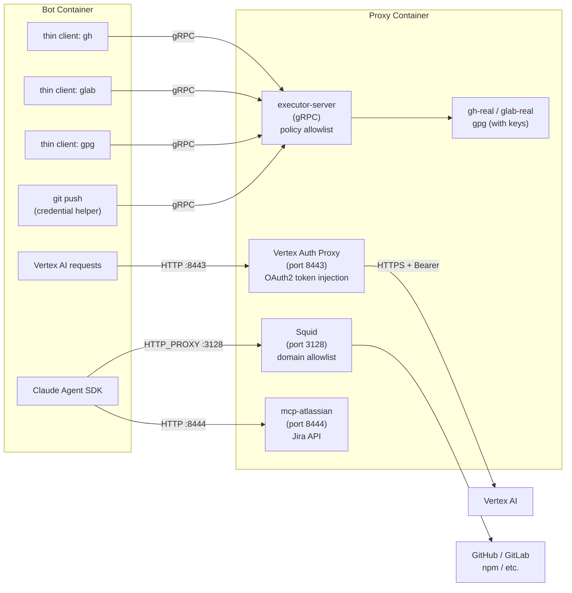

# Dev Bot (Rehor)

An autonomous developer agent that picks groomed Jira tickets, implements them, opens PRs, and maintains them through review — all without human intervention. It runs in a polling loop using the Claude Agent SDK (Python) and integrates with Jira, GitHub/GitLab, and a persistent memory system.

## Documentation

| Document | Description |
|----------|-------------|
| [Architecture](ARCHITECTURE.md) | System design, credential isolation, component overview |
| [Setup](SETUP.md) | Local development setup and configuration |
| [Operations](OPERATIONS.md) | Production operations, monitoring, troubleshooting |
| [Onboarding a New Instance](docs/onboarding-new-instance.md) | Step-by-step guide for adding a new bot instance |
| [Presets](docs/presets/README.md) | Preset system — env presets (node, go, browser...) and workflow presets |
| [Scheduling](docs/scheduling.md) | KEDA cron scaling for bot instances (business hours only) |

## Prerequisites

Before setting up the bot, make sure you have the following installed:

| Dependency | Purpose | Install |
|------------|---------|---------|
| [Claude Code](https://docs.anthropic.com/en/docs/claude-code) | Agent runtime (bundled with the SDK) | `npm install -g @anthropic-ai/claude-code` |
| [uv](https://docs.astral.sh/uv/) | Python package manager | `curl -LsSf https://astral.sh/uv/install.sh \| sh` |
| [Podman](https://podman.io/) or Docker | Memory server, target repo dev environments | `brew install podman` or install Docker |
| [Node.js](https://nodejs.org/) + npm | TypeScript LSP server | `brew install node` or via nvm |
| [jq](https://jqlang.github.io/jq/) | JSON processing | `brew install jq` |
| [gh](https://cli.github.com/) | GitHub CLI | `brew install gh` then `gh auth login` |
| [glab](https://gitlab.com/gitlab-org/cli) | GitLab CLI (only for GitLab repos) | `brew install glab` then `glab auth login --hostname gitlab.cee.redhat.com` |

The bot also uses the [mcp-atlassian](https://github.com/sooperset/mcp-atlassian) MCP server for Jira integration — it runs inside the proxy container (see [Architecture](#architecture-credential-isolation)).

### Authentication

The bot needs credentials for several services. Set these in `.env` (copy from `.env.example` or create manually):

```bash
# Jira — required
# Generate your API token at: https://id.atlassian.com/manage-profile/security/api-tokens
JIRA_URL=https://your-instance.atlassian.net
JIRA_USERNAME=your-email@company.com
JIRA_API_TOKEN=your-jira-api-token

# Claude — GCP Vertex AI (service account)
# Follow the RH internal guide to set up Vertex AI access
# and generate a service account key file (sa-key.json).
GOOGLE_SA_KEY_B64=$(base64 < sa-key.json)
VERTEX_ALLOWED_MODELS=claude-sonnet-4-6,claude-opus-4-6,claude-haiku-4-5

# GitHub — bot PAT for gh CLI
GH_TOKEN=ghp_...

# GitLab — personal PAT for glab CLI (api + write_repository scopes)
GITLAB_TOKEN=glpat-...
```

## Quick Start

```bash
# 1. Clone this repo
git clone <repo-url> dev-bot && cd dev-bot

# 2. Install Python dependencies and set up LSP + memory server
make init

# 3. Create your .env file with credentials (see Authentication above)
cp .env.example .env  # then edit with your values

# 4. Run the bot for a specific team label
make run LABEL=hcc-ai-framework
```

The bot will start polling for Jira tickets with the `hcc-ai-framework` label. It logs to stdout and `bot.log`.

### Available make targets

```
make init              # Full setup: install deps, LSP, start memory server
make run               # Run the bot on host (LABEL=hcc-ai-framework by default)
make run-rbac          # Run the bot with platform-accessmanagement label
make stop              # Stop a running bot (release lock)
make logs              # Tail bot log
make memory-server     # Start memory server + postgres (standalone)
make memory-server-stop # Stop standalone memory server
make dashboard         # Build the dashboard UI
make costs             # Show all cost data
make costs-today       # Show today's costs
make costs-week        # Show this week's costs
make seed-costs        # Import costs.jsonl into the database
make help              # Show all available commands
```

You can also run the bot directly: `uv run dev-bot --label <your-label>`

## How it works

The bot operates in **cycles**. Each cycle, it evaluates all of its tracked work and acts on exactly one item, following a strict priority order:

### Priority 0: Respond to feedback and finish incomplete work

The bot starts every cycle by checking its tracked tasks for anything that needs immediate attention:

1. **New feedback** — PR review comments, Jira comments, failing CI, or merge conflicts since the bot last addressed a task. Human feedback is always the highest priority.
2. **Interrupted work** — if the bot ran out of turns mid-implementation (branch created but no PR yet), it picks up where it left off using progress metadata.
3. **Unfinished investigations** — investigation tickets where the analysis hasn't been posted to Jira yet.

### Priority 1: Maintain existing PRs

For each open PR, the bot checks (in order): CI failures, merge conflicts, review feedback, Jira comments, and merged PRs. When a PR merges, it closes the task, transitions the Jira ticket to Done, and saves what it learned to memory.

### Priority 1.5: Check assigned Jira tickets

Scans tickets assigned to the bot for merged PRs it hasn't noticed or new Jira comments.

### Priority 2: Pick new work

Only when everything is clean — no pending feedback, no interrupted work, all PRs green — the bot looks for new tickets. It searches memory for relevant past learnings, claims the ticket, creates a branch, implements, tests, and opens a PR.

## Preparing tickets for the bot

Tickets must be explicitly groomed. The bot never picks random backlog items.

### Required labels

- **Primary label** (e.g. `hcc-ai-framework`, `hcc-ai-platform-accessmanagement`) — marks the ticket as bot-eligible for a specific team. The bot only picks up tickets with its configured label.
- **`repo:<name>`** or **`repo:<org>/<name>`** — identifies the target repo. Bare names (e.g. `repo:insights-chrome`) match keys in `project-repos.json` directly. Org-prefixed names (e.g. `repo:RedHatInsights/insights-chrome`) are resolved via the upstream URL. A ticket can have multiple `repo:` labels for cross-repo work.

### Optional labels

- `needs-investigation` — bot investigates and reports findings instead of implementing
- `platform-experience-ui` — routes the ticket to the UI sprint (scrum boards only)

### Interactive grooming

There's a prompt that walks you through preparing a ticket:

```bash
claude --prompt-file prompts/groom.md
```

It helps identify repos, suggests labels, and produces a ready-to-create ticket with acceptance criteria.

### What makes a good bot ticket

- **Clear problem statement** — current vs expected behavior
- **Specific files or components** if known (saves the bot time)
- **URL paths** where the issue is visible
- **Acceptance criteria** as a concrete checklist
- **Scoped to a single PR** — if it's too big, split it

The bot is a good developer but has zero tribal knowledge. Don't assume it knows your team's history.

## Adding a new repo

All repos use forks by default. The bot pushes to the fork and opens PRs/MRs targeting the upstream repo.

1. Fork the repo under the bot's account (e.g. `platex-rehor-bot`):
   ```bash
   gh repo fork RedHatInsights/my-repo --clone=false
   ```
2. Add to the remote config repo's `project-repos.json`:
   ```json
   "my-repo": {
     "url": "https://github.com/platex-rehor-bot/my-repo.git",
     "upstream": "https://github.com/RedHatInsights/my-repo.git"
   }
   ```
   For GitLab repos, add `"host": "gitlab"`.
3. Add a `repo:my-repo` label to the Jira ticket. You can also use the full `repo:OrgName/my-repo` format.

The bot clones repos automatically when it picks up a ticket. It fetches from `upstream`, creates branches based on the latest upstream code, pushes to `origin` (the fork), and opens PRs/MRs targeting the upstream repo.

### Persona selection

Personas are NOT hardcoded to repos. The bot dynamically selects the best-fit persona(s) based on the ticket description and the repo's tech stack (e.g. `package.json` → `frontend`, `go.mod` → `backend`/`operator`, Dockerfile-only → `tooling`, config repo → `config`). For CVE tickets, the `cve` persona layers on top of the base persona.

## Remote config

Personas, `project-repos.json`, per-persona MCP servers, and custom skills live in a **remote config repo** rather than being baked into the bot image. This allows updating bot behavior without rebuilding.

At startup, `run.py` clones/pulls the repo specified by `BOT_CONFIG_REPO` and merges its contents using the **merge engine** (`bot/merge.py`):

- Remote personas, project-repos entries, MCP servers, and skills are added to the bot's runtime config
- Bot-critical settings (security hooks, core skills, sandbox permissions, core MCP servers) are **protected** and cannot be overridden by remote config
- The merge engine produces a report of what was added, overridden, or protected

Set the repo URL via env var:
```bash
BOT_CONFIG_REPO=https://github.com/your-org/your-config-repo
```

The config repo should contain an `agent/` directory with:
```
agent/
  project-repos.json   # Repo label → git URL mapping
  personas/            # Per-repo-type guidelines (frontend/, backend/, etc.)
  mcp.json             # Additional MCP servers
  skills/              # Custom skills
```

## Running as a runner instance (Dockerfile.runner)

For creating **new bot instances** with custom personas and config, the repo includes `Dockerfile.runner` — a full build template designed for use via git submodule.

Runner repos add dev-bot as a submodule and build from `Dockerfile.runner`, which provides two extension points:

- **`setup.sh`** (required) — custom build steps (install packages, write config, etc.)
- **`instance/`** (optional) — extra files COPYed to `/home/botuser/app/instance/`

### Setting up a runner repo

```bash
# 1. Create your runner repo
mkdir my-bot-instance && cd my-bot-instance
git init

# 2. Add dev-bot as a submodule
git submodule add https://github.com/RedHatInsights/platform-frontend-ai-dev.git dev-bot

# 3. Create setup.sh (required)
cat > setup.sh << 'EOF'
#!/bin/bash
set -e
echo "my-bot-instance" > /home/botuser/app/.instance-id
# Add custom build steps here (dnf install, config, etc.)
EOF

# 4. Create instance/ directory (optional)
mkdir -p instance

# 5. Build
docker build -f dev-bot/Dockerfile.runner -t my-bot-instance:local .
```

To update to the latest dev-bot: `git submodule update --remote dev-bot`

## Running the services

### Option A: OpenShift (recommended)

The production deployment. Bot, proxy, and memory server run as separate pods with full credential isolation and network policies. See `deploy/template.yaml` and `OPERATIONS.md` for details.

### Option B: Bot on host (advanced)

Running the bot directly on your machine bypasses the security harness (proxy-based credential isolation, Squid allowlist, bash hooks enforcement). This mode requires manual setup of git identity, GPG signing, and CLI auth, and is not recommended for production use.

```bash
# 1. Configure .env with credentials (see Authentication above)
cp .env.example .env

# 2. Start memory server + postgres
make memory-server

# 3. Run bot on host (uses localhost:8080 for memory server)
make run LABEL=hcc-ai-framework
```

### Memory server + dashboard

The memory server runs as containers (PostgreSQL with pgvector + Python app). `make init` starts it automatically.

```bash
make memory-server              # Start
make memory-server-stop         # Stop
```

Dashboard at **http://localhost:8080** — tasks, memories, semantic search, 3D embedding map. Live WebSocket updates.

### Browser for visual verification

For UI changes, the bot uses chrome-devtools MCP to take screenshots. Start a Chrome/Chromium instance with remote debugging:

```bash
./start-chromium.sh
```

This launches Chrome on port 9222 with a separate profile. Edit the script to use `chromium` if that's what you have.

### 3. Configuration

`config.json` controls the bot's behavior:

```json
{
  "claude": {
    "maxTurns": 100,
    "model": "claude-opus-4-6"
  },
  "polling": {
    "intervalSeconds": 300,
    "idleIntervalSeconds": 3600
  }
}
```

MCP servers are configured in `.mcp.json` (project-level). Remote config repos can provide additional MCP servers via `agent/mcp.json`.

## Personas

Personas provide domain-specific guidelines for different repo types. They live in the remote config repo under `agent/personas/<type>/prompt.md`:

| Persona | Scope |
|---------|-------|
| `frontend` | React/TypeScript/PatternFly repos. Visual verification, `npm run lint/test`. |
| `backend` | Go and Node.js backend services. |
| `rbac` | Django/DRF RBAC service (insights-rbac). Container-based dev env, `make unittest-fast`. |
| `operator` | Kubernetes operators (Go). |
| `config` | Config repos (app-interface). Read-only or GitLab MR workflow. |
| `cve` | CVE remediation — dependency upgrades, base image updates, security scanning. |
| `tooling` | Build/dev infrastructure — Dockerfiles, shell scripts, proxy configs. |
| `rds-upgrade` | RDS blue-green upgrades in app-interface. Layers on `config`. |

## Skills

The bot has built-in skills (Claude Code slash commands) in `.claude/skills/`:

| Skill | Purpose |
|-------|---------|
| `triage` | Pre-gathers all active task statuses, PR/MR states, CI, reviews, Jira comments |
| `new-work` | Fetches unassigned sprint candidates with full context |
| `claim-ticket` | Claims a Jira ticket (assign, transition, sprint) |
| `push-and-pr` | Pushes branch and creates PR/MR via API |
| `post-pr` | Post-PR actions (Jira transition, comments, linked issues) |
| `wrap-up` | Handles PR merge cleanup (archival, Jira transition, Slack, branch deletion) |
| `slack-notify` | Sends Slack notifications with 48h per-ticket cooldown |
| `auto-fork` | Forks repos under the bot's GitHub account |
| `gh-release-upload` | Uploads screenshots to GitHub releases for PR comments |

## Memory system

The bot has persistent memory via MCP:

- **Task tracking** — structured records of active work with status, PR links, and progress metadata. Hard cap of 10 concurrent active tasks. When interrupted mid-cycle, the bot saves progress (`last_step`, `next_step`, `files_changed`) so the next cycle resumes seamlessly.
- **RAG memory** — vector-searchable knowledge base of learnings from completed tickets, PR review feedback, and codebase patterns. The bot searches this before starting any new ticket, so it improves over time.

### Exporting and importing memory

The bot's memory (tasks, learnings, cost data) can be exported and shared so others can bootstrap from existing knowledge.

```bash
# Export current memory to a SQL dump
make memory-dump        # → data/memory-dump.sql

# Import on another machine (additive — skips duplicates)
make memory-import      # ← data/memory-dump.sql

# Full reset — wipe all data and reimport from dump
make memory-reset
```

The dump file (`data/memory-dump.sql`) is gitignored. Store it in shared storage (e.g. Google Drive) and distribute to team members setting up new instances.

## Cost tracking

Each cycle records its cost to `costs.jsonl` and the memory server database.

```bash
make costs           # All recorded cycles
make costs-today     # Today only
make costs-week      # Last 7 days
./costs.sh 2026-03-31   # Specific date
./costs.sh backfill     # Import from bot.log
```

The dashboard at http://localhost:8080 shows cost breakdowns, per-cycle metrics, task status, memory search, and a 3D embedding visualization.

## Architecture: Credential Isolation

The bot uses a **defense-in-depth** model to prevent credential leakage. Secrets never enter the bot container — all credential-bearing operations are proxied through a separate **proxy container**.



### How it works

- **CLI tools** (`gh`, `glab`, `gpg`) in the bot container are **thin client shims** — a single Go binary (hardlinked as `gh`, `glab`, `gpg`) that detects the tool name from `argv[0]` and forwards commands over gRPC to the proxy's executor server.
- The **executor server** validates commands against a built-in **policy allowlist** (e.g. `gh pr create` is allowed, `gh auth token` is blocked), then executes the real CLI binary with full credentials.
- **Git credential helpers** are configured globally so `git push` transparently authenticates via the thin client → proxy path.
- **GPG commit signing** works the same way — git invokes `gpg --sign` which routes through the thin client to the proxy's GPG keyring.
- **Vertex AI auth proxy** (port 8443) — the bot sends unauthenticated requests to the proxy's embedded HTTP server. The proxy injects OAuth2 Bearer tokens from the GCP service account, rewrites dummy project/region values to real ones, enforces a model allowlist, and forwards to the Vertex AI API. The bot never sees the SA key or tokens.
- **Jira MCP server** (port 8444) — mcp-atlassian runs inside the proxy container with the Jira API token. The bot connects via streamable HTTP transport — no Jira credentials in the bot container.
- **HTTP/HTTPS traffic** is routed through Squid with a domain allowlist — the bot container has no direct internet access.
- **Bash hooks** (`.claude/hooks/validate-bash.sh`) block dangerous commands (curl, eval, credential reads) as an additional defense layer.

### What lives where

| Component | Bot Container | Proxy Container |
|-----------|:---:|:---:|
| GH_TOKEN / GITLAB_TOKEN | - | yes |
| GPG private key | - | yes |
| GCP service account key | - | yes |
| Jira API token | - | yes |
| gh / glab CLIs (real) | - | yes |
| gh / glab / gpg (thin client) | yes | - |
| Squid proxy | - | yes |
| Vertex AI auth proxy | - | yes |
| mcp-atlassian (Jira MCP) | - | yes |
| Agent SDK + bot code | yes | - |

### Dev proxy (local UI verification)

The `dev-proxy/` directory contains a custom Caddy build for local UI verification against stage environments. The bot starts it when it needs to verify frontend changes against a running HCC stage deployment.

### Deployment

- **OpenShift**: Bot and proxy run as separate pods connected via ClusterIP Service. A `NetworkPolicy` restricts bot egress to the proxy and memory-server pods only.
## Project structure

```
dev-bot/
  pyproject.toml         # Python project config (uv workspace root)
  Makefile               # Common commands
  bot/                   # Agent runner (Python package)
    run.py               # Main loop + remote config sync
    agent.py             # SDK query invocation per cycle
    config.py            # Config loading + MCP server merging
    costs.py             # Cost tracking
    merge.py             # Remote config merge engine (protected-key registry)
  config.json            # Model, polling intervals, Jira config
  CLAUDE.md              # Full agent instructions (the bot's brain)
  .mcp.json              # MCP server connections (Jira, memory, browser)
  .env                   # Credentials (not committed)
  Dockerfile             # Bot container image
  Dockerfile.runner      # Runner instance template (used via git submodule)
  docker-compose.yml     # Full stack: bot + proxy + memory server + postgres
  entrypoint.sh          # Container entrypoint (remote config sync + bot start)
  init.sh                # Installs LSP, downloads BrowserMCP, starts memory server
  costs.sh               # Cost report CLI
  start-chromium.sh      # Launch Chrome with remote debugging
  .claude/               # Claude Code config
    settings.json        # Permissions + sandbox config
    hooks/               # Bash validation hooks (security)
    skills/              # Built-in skills (triage, claim-ticket, push-and-pr, etc.)
  proxy/                 # Credential-bearing proxy (Squid + executor + Vertex auth + Jira MCP)
    Dockerfile           # Squid + gh-real/glab-real + executor + mcp-atlassian
    squid.conf           # Domain allowlist
    start.sh             # Process manager (Squid + executor-server + mcp-atlassian)
    executor/            # gRPC executor + Vertex auth proxy (Go)
      proto/             # Protobuf service definition
      gen/               # Generated gRPC code
      cmd/server/        # Executor server binary (gRPC + HTTP)
      cmd/client/        # Thin client binary (hardlinked as gh/glab/gpg)
      policy.go          # CLI command allowlist engine
      vertex.go          # Vertex AI reverse proxy (URL rewrite + token injection)
      vertex_policy.go   # Vertex AI model allowlist engine
  dev-proxy/             # Custom Caddy for local UI verification against stage
    Caddyfile            # Reverse proxy config
    main.go              # Caddy with custom modules
    start-proxy.sh       # Start script
  memory-server/         # Persistent memory + task tracking
    bot_memory_server/   # Python package
      server.py          # FastMCP + Starlette + WebSocket
      tools/             # MCP tools (task_*, memory_*, slack_notify, cycles)
      api.py             # REST API for the dashboard
      artifacts.py       # PR/artifact tracking
      migrations/        # Database migrations (zero-downtime)
      static/            # Dashboard UI (React + Vite, built assets)
    docker-compose.yml   # PostgreSQL (pgvector) + memory server
  prompts/               # Interactive prompts (grooming, etc.)
  dashboard/             # Dashboard source (React + Vite + TypeScript)
  deploy/                # OpenShift deployment template
  tests/                 # Bot unit tests (merge engine, etc.)
  scripts/               # Utility scripts
  repos/                 # Cloned target repos (created on demand, gitignored)
```

## Example

- Jira ticket: [RHCLOUD-46011](https://redhat.atlassian.net/browse/RHCLOUD-46011)
- PR created by the bot: [astro-virtual-assistant-frontend#368](https://github.com/RedHatInsights/astro-virtual-assistant-frontend/pull/368)
