# Bot Workflow Loop

The bot operates as an autonomous loop: a scheduler triggers cycles, lightweight Python scripts gather data and decide whether there's work to do, and only then does a Claude AI session start. This design ensures AI tokens are spent only when there's real work — the common "nothing to do" case costs zero.

## Architecture Overview

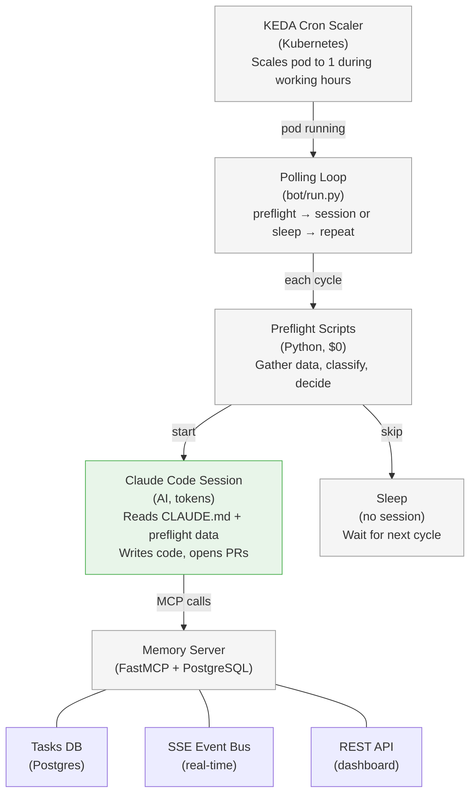

## The Cycle

Each iteration of the polling loop follows this sequence:

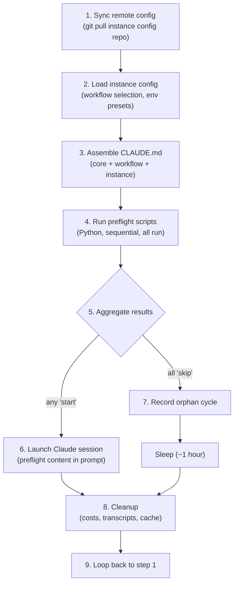

### When AI Runs vs When It Doesn't

| Scenario | AI runs? | Cost |
|----------|:--------:|------|
| No active tasks, no open bot PRs | No | $0 |
| Active task, PR CI still pending | No | $0 |
| Active task, PR is clean (no issues) | No | $0 |
| Active task, PR CI failed | **Yes** | tokens |
| Active task, PR has review feedback | **Yes** | tokens |
| Active task, PR was merged | **Yes** | tokens |
| No active tasks, new Jira candidate found | **Yes** | tokens |
| All preflight scripts error (API down) | No | $0 (backoff) |

The common case — "nothing changed since last cycle" — is handled entirely by Python scripts. The AI only wakes up when a preflight script explicitly returns `"start"`.

---

## Preflight System

Preflight scripts are Python programs that run before each Claude session. They gather data from external systems (GitHub, GitLab, Jira, memory server), classify it, and decide whether the AI should wake up.

For the full reference on writing preflight scripts — output contract, naming conventions, execution model, shared utilities, error handling, and inter-script state — see [Writing Custom Preflight Scripts](presets/custom-preflight.md).

This section covers the concepts that tie preflight into the broader workflow loop.

### Aggregation

All scripts run to completion before any decision is made. There is no short-circuit — if script 01 returns `"start"`, scripts 02, 03 still run because the AI needs the full picture.

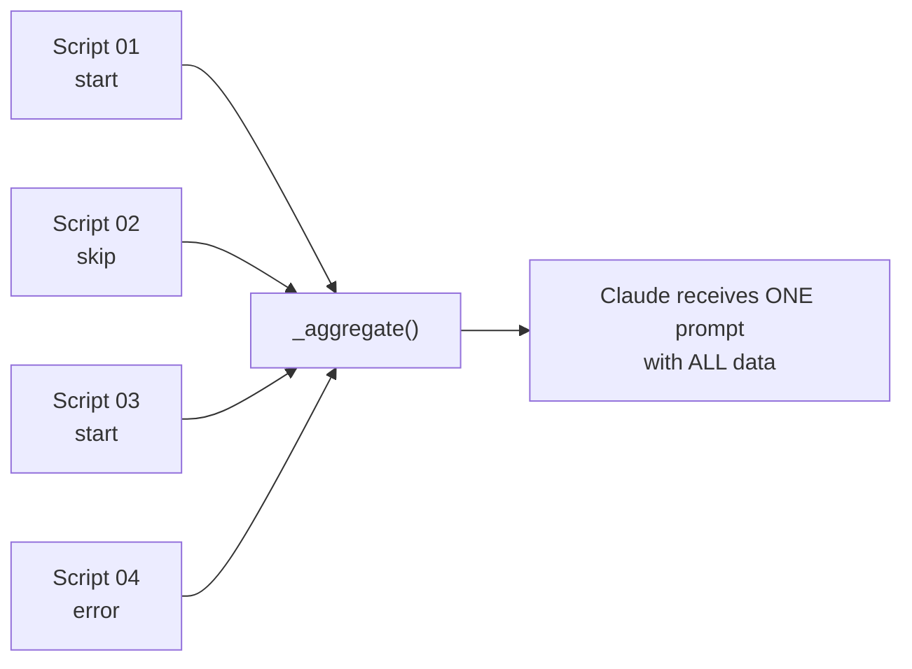

| Condition | Result |
|-----------|--------|
| Any script returns `"start"` (others skip or error) | Session starts. All content merged. |
| All scripts return `"skip"` | No session. Loop sleeps. |
| All scripts return `"error"` | No session. Exponential backoff (up to 300s). |

One session receives all data — not one session per `"start"`. This lets Claude triage across all data sources. Errors are prepended as `[PREFLIGHT ERROR]` warnings so Claude knows a data source is degraded.

### Preflight Is Read-Only

Preflight scripts only **read** tasks — they never create, update, or archive them. This separation is intentional: preflights are pure functions over external state. They can never corrupt the task system, even if they crash. See [the design doc](presets-design.md) for the rationale.

### What a Preflight Script Must Do

Every preflight script follows a two-phase pattern. The order matters — check tasks first, then check for work.

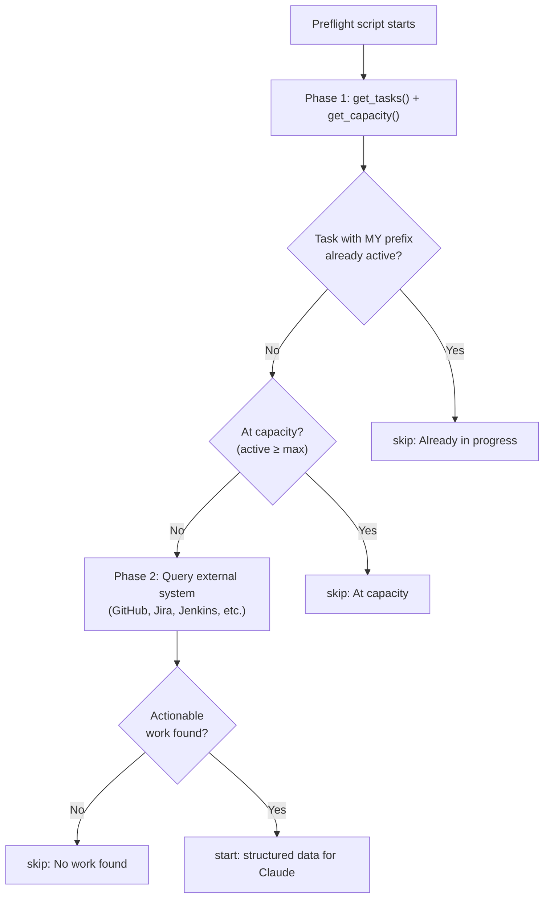

#### Phase 1: Task Checks

These three checks prevent the bot from creating duplicate work or exceeding capacity. Every preflight script should include them:

```python
from common import get_tasks, get_capacity, output_result

TASK_KEY_PREFIX = "my-workflow:"  # unique to your workflow

tasks = get_tasks()
active_n, max_n = get_capacity()
active = [t for t in tasks if t.get("status") in ("in_progress", "pr_open", "pr_changes")]

# Check for duplicate work
my_tasks = [t for t in active if t.get("external_key", "").startswith(TASK_KEY_PREFIX)]
if my_tasks:
    output_result("skip", f"Already in progress: {my_tasks[0]['external_key']}")
    return

# Check capacity (global — counts ALL active tasks, not just yours)
if active_n >= max_n:
    output_result("skip", f"At capacity ({active_n}/{max_n})")
    return
```

The `TASK_KEY_PREFIX` is how a workflow identifies "its" tasks. Each workflow uses a different prefix (see [Task Identity](#task-identity) below).

#### Phase 2: Work Discovery

This is workflow-specific. Query your external system and decide if there's actionable work:

```python
prs = find_bot_prs(upstream_repo, bot_author)
if len(prs) < 2:
    output_result("skip", f"Only {len(prs)} PRs, need ≥2")
    return

output_result(
    "start",
    json.dumps(
        {
            "repo": upstream_repo,
            "pr_count": len(prs),
            "prs": pr_summary,
            "task_key": f"{TASK_KEY_PREFIX}{upstream_repo}",  # pre-computed for the agent
        }
    ),
)
```

Key points:
- The `content` in `"start"` becomes the AI's input prompt — include all data Claude needs
- Pre-compute the `task_key` so the agent doesn't have to figure out the key format
- Filter out noise (healthy items, resolved issues) — every character costs tokens

### Preflight-to-Agent Data Handoff

The `content` field from `output_result("start", content)` is the **only data channel** between the preflight and the agent. The framework injects it into the Claude prompt like this:

```
## Pre-flight Data

The following data was gathered by pre-flight scripts.
Do NOT re-fetch task statuses, PR statuses, or Jira comments already shown below.

{content from all "start" scripts, concatenated}
```

Include everything the agent needs to act:
- **What to work on** — repo name, PR numbers, Jira keys
- **Pre-computed task key** — so the agent uses the correct `external_key` format
- **Classification results** — MERGED/CI FAIL/FEEDBACK buckets (already triaged)
- **Context** — comments, error messages, CI pipeline URLs

The CLAUDE.md runbook then tells the agent how to interpret this data and what actions to take.

---

## Task State Machine

Tasks are the coordination primitive between cycles. They track what the bot is working on, prevent duplicate work, and manage capacity.

### The 6 States

Defined as a PostgreSQL enum in `memory-server/bot_memory_server/schema.sql`:

```sql
CREATE TYPE task_status AS ENUM (
    'in_progress', 'pr_open', 'pr_changes', 'paused', 'done', 'archived'
);
```

| Status | Blocks new work? | Who sets it | Meaning |
|--------|:----------------:|-------------|---------|
| `in_progress` | **Yes** | Agent (`task_add`) | Agent is actively working (coding, testing) |
| `pr_open` | **Yes** | Agent (`task_update`) | PR created, waiting for CI and/or review |
| `pr_changes` | **Yes** | Agent (`task_update`) | Reviewer requested changes, agent addressing them |
| `paused` | No | Agent (`task_update`) | Work intentionally paused (blocked on question). Has `paused_reason`. |
| `done` | No | Agent (`task_update`) | Work completed — PR merged, cleanup finished |
| `archived` | No | Agent (`task_remove`) | Soft-deleted — excluded from all queries by default |

### Active Statuses

The three states that block new work are defined in `memory-server/bot_memory_server/tools/tasks.py`:

```python
ACTIVE_STATUSES = ("in_progress", "pr_open", "pr_changes")
```

Preflight scripts use this to:
1. **Prevent duplicate work** — skip if a task with a matching `external_key` prefix is active
2. **Enforce capacity** — skip if active task count ≥ `MAX_ACTIVE` (default 10)

### State Diagram

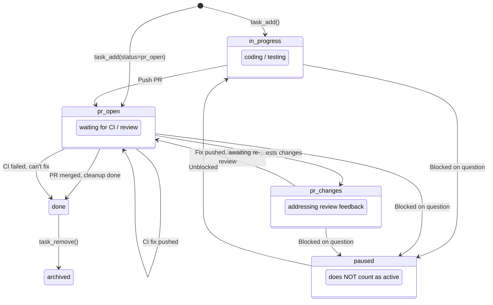

### State Transitions

| # | From | To | Who | When |
|---|------|-----|-----|------|
| 1 | *(none)* | `in_progress` | Agent via `task_add` | Agent claims a Jira ticket and starts coding |
| 2 | *(none)* | `pr_open` | Agent via `task_add` | Agent creates task after pushing PR (e.g. consolidation workflows) |
| 3 | `in_progress` | `pr_open` | Agent via `task_update` | Agent pushes code and opens a PR |
| 4 | `pr_open` | `pr_open` | Agent via `task_update` | Pushed a CI fix, still waiting |
| 5 | `pr_open` | `pr_changes` | Agent via `task_update` | Addressed reviewer feedback |
| 6 | `pr_changes` | `pr_open` | Agent via `task_update` | Pushed review fix, waiting for re-review |
| 7 | `pr_open` | `done` | Agent via `task_update` | CI passed and PR merged, cleanup complete |
| 8 | `pr_open` | `done` | Agent via `task_update` | CI failed, can't fix, branch deleted |
| 9 | any active | `paused` | Agent via `task_update` | Blocked on external question |
| 10 | `paused` | `in_progress` | Agent via `task_update` | Unblocked, resuming work |
| 11 | `done` | `archived` | Agent via `task_remove` | Cleanup, hide from default queries |

### Task Identity

Each task is uniquely identified by `(external_key, source_type)`:

```sql
UNIQUE(external_key, source_type)
```

#### The `external_key` Convention

The `external_key` follows the pattern: `<workflow-name>:<scope>`

| Part | Purpose | Example |
|------|---------|---------|
| `workflow-name` | Namespace that groups all tasks from one workflow | `konflux-pr-squash` |
| `:` | Separator | — |
| `scope` | What specifically is being worked on | `project-kessel/insights-rbac` |

Full examples:

| Workflow | `external_key` | `source_type` |
|----------|----------------|---------------|
| Jira-driven | `RHCLOUD-12345` | `jira` |
| Konflux PR squash | `konflux-pr-squash:project-kessel/insights-rbac` | `github` |
| Custom CI fixer | `ci-fix:org/repo#42` | `github` |

The `workflow-name` prefix is what preflight scripts use to find "their" tasks (see [Phase 1: Task Checks](#phase-1-task-checks) above). It must be:
- **Unique per workflow** — two different workflows must not share a prefix
- **Deterministic** — the same work must always produce the same key
- **Stable** — if the bot wakes up and checks, the key shouldn't have changed

#### The `source_type` Field

The `source_type` defaults to `"jira"`. Non-Jira workflows **must set it explicitly** — getting it wrong means lookups and duplicate-prevention checks will fail silently, because `task_get` and `task_update` look up by `(external_key, source_type)`.

Common values: `"jira"`, `"github"`, `"gitlab"`, `"scheduled"`.

#### How Task Keys Flow Through the System

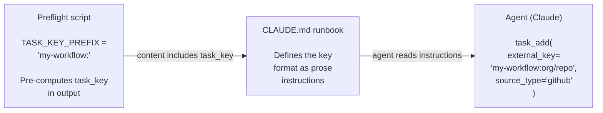

1. **Preflight defines the prefix** — in Python code, used for duplicate checking
2. **Preflight pre-computes the full key** — includes it in the `"start"` content so the agent doesn't have to guess
3. **CLAUDE.md documents the key format** — as prose instructions for the AI agent
4. **Agent uses the key** — in `task_add` and `task_update` MCP calls

### MCP Tools

The agent interacts with tasks through MCP tools exposed by the `bot-memory` server. For the full tool reference, see [the core instructions](../presets/core/CLAUDE.md#task-tools).

| Tool | Purpose | Key behavior |
|------|---------|-------------|
| `task_add` | Create a new task | **Refuses if ≥10 active tasks.** Publishes `task_added` event. |
| `task_update` | Change status, summary, metadata | Lookup by `external_key` + `source_type`. Metadata is merged (not replaced). |
| `task_get` | Fetch one task | Lookup by `external_key` + `source_type`. |
| `task_list` | List all tasks | Filters by status, instance_id. Excludes `archived` by default. |
| `task_remove` | Archive a task | Sets status to `archived` (soft delete, preserves history). |
| `task_check_capacity` | Check capacity | Returns `{active: N, max: 10, has_capacity: bool}`. |

### Who Reads vs Who Writes

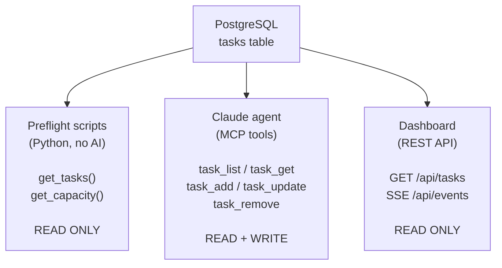

---

## Complete Workflow Example

This traces a full lifecycle through multiple scheduler ticks, showing every task state transition. The example uses the Konflux PR consolidation workflow, but the pattern applies to any workflow.

### Tick 1 — First Run, No Task Exists

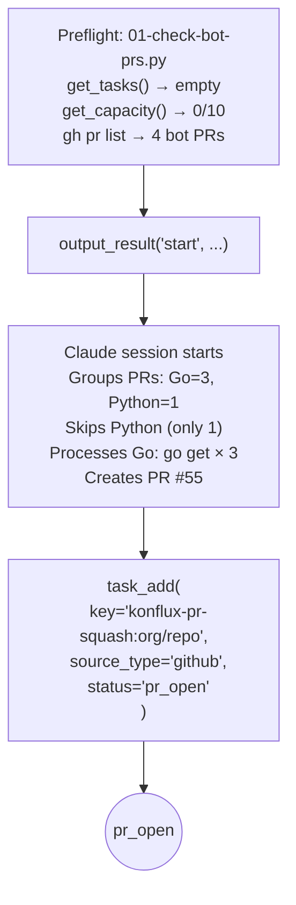

### Tick 2 — CI Still Running

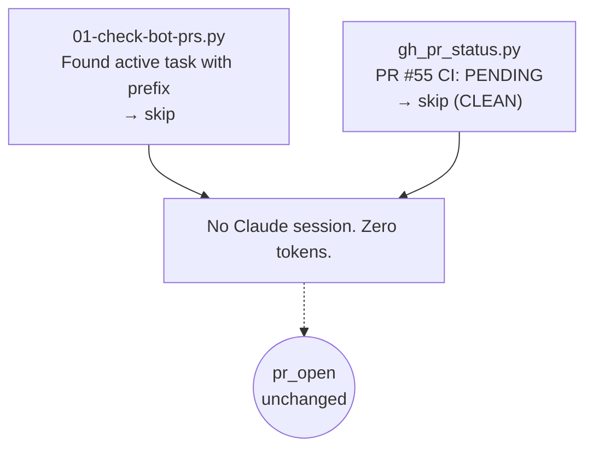

### Tick 3 — CI Passed, PR Merged

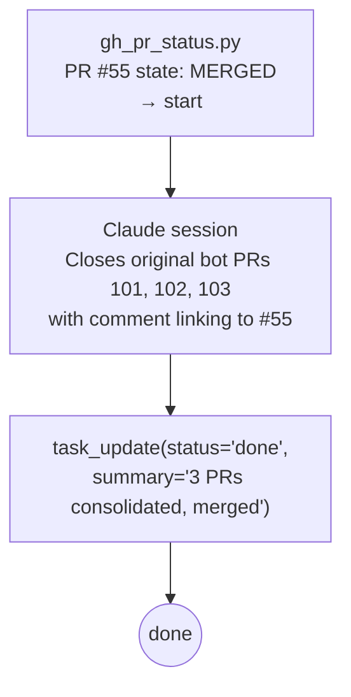

### Tick 4 — Loop Is Free Again

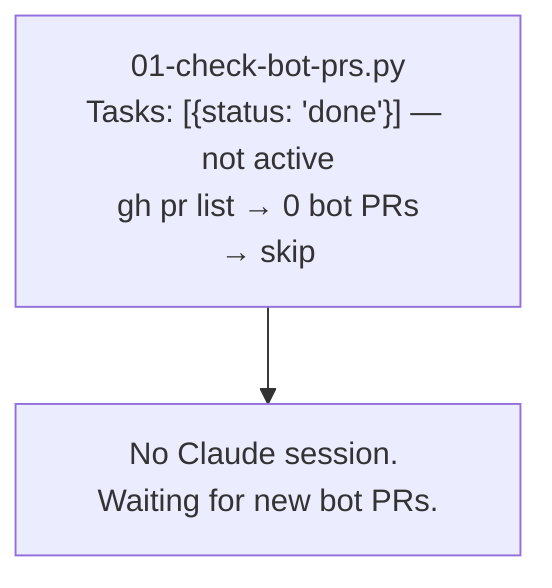

### Alternative: CI Fails

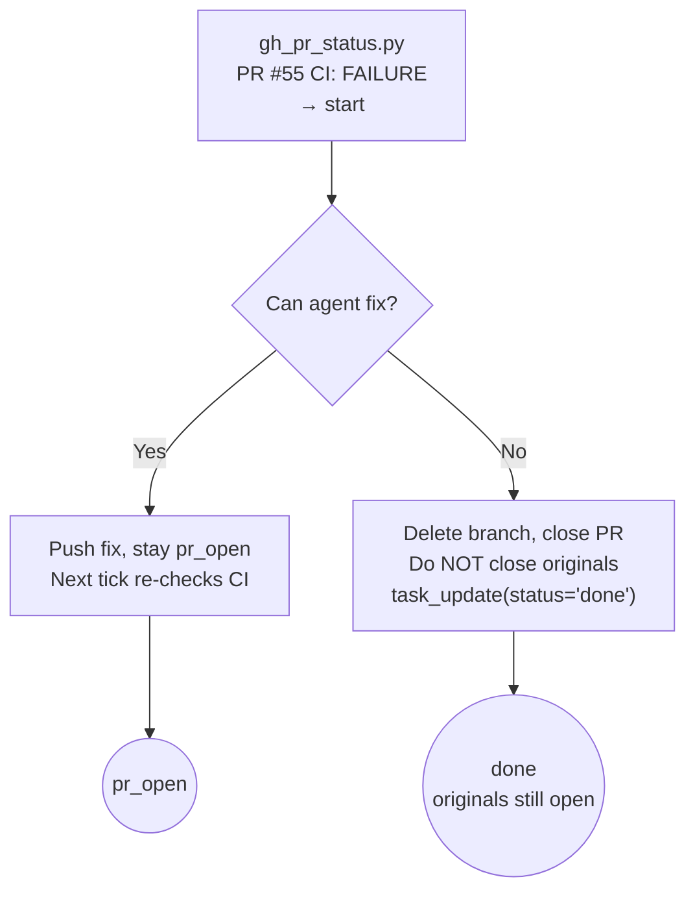

### Alternative: Review Feedback

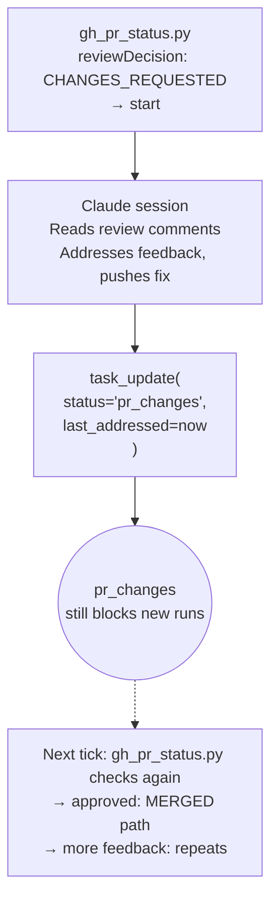

---

## Built-In Preflight Scripts

The `jira-sprint` workflow includes three preflight scripts:

| Script | What it checks | Returns "start" when |
|--------|---------------|---------------------|
| `01-gh-pr-status.py` | GitHub PR states (CI, reviews, conflicts, merges) | Any PR is merged, has CI failure, has conflicts, or has new review feedback |
| `02-gl-mr-status.py` | GitLab MR states (pipelines, threads) | Same as above but for GitLab |
| `03-jira-sprint.py` | Jira sprint for comments and new work candidates | Active task has new Jira comments, or new unassigned ticket found |

### GitHub PR Classification Buckets

`gh_pr_status.py` classifies each PR into one of these buckets:

| Bucket | Condition | Actionable? |
|--------|-----------|:-----------:|
| MERGED | PR state is `MERGED` | **Yes** — agent wraps up |
| CLOSED | PR state is `CLOSED` | **Yes** — agent handles closure |
| CI FAILING | `statusCheckRollup` has `FAILURE` conclusions | **Yes** — agent investigates |
| CONFLICTS | `mergeable` is `CONFLICTING` | **Yes** — agent rebases |
| FEEDBACK | `reviewDecision` is `CHANGES_REQUESTED`, or new review comments from humans | **Yes** — agent addresses |
| CLEAN | No issues found | No |

The `last_addressed` timestamp on each task is used to filter out old feedback. Reviews submitted before `last_addressed` are ignored — the bot already handled them in a prior cycle.

---

## Related Docs

- [Workflow Presets](presets/workflows.md) — Available workflows and their decision loops
- [Writing Custom Preflight Scripts](presets/custom-preflight.md) — How to write your own preflight scripts
- [Creating Custom Workflows](presets/custom-workflows.md) — Building complete custom workflows
- [Scheduling](scheduling.md) — KEDA cron scaling configuration
